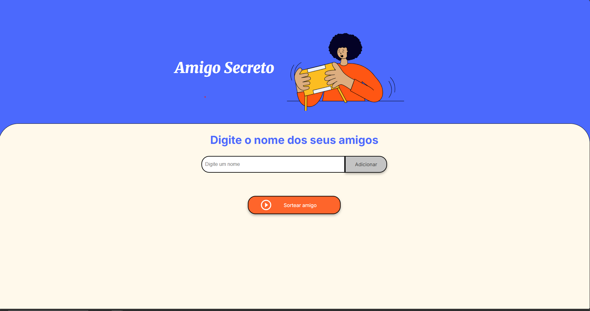

# 🎁 Projeto Amigo Secreto

Este projeto é um desafio prático de um curso, com o objetivo de desenvolver uma aplicação simples e interativa para realizar sorteios de **amigo secreto**.

Os usuários podem digitar os nomes dos participantes e realizar o sorteio com apenas um clique.

---

## 📸 Preview



---

## 🚀 Funcionalidades

- Adicionar nomes de amigos à lista.
- Exibir a lista de participantes.
- Realizar o sorteio do amigo secreto com resultado visível na tela.
- Estilo visual moderno e responsivo com foco em usabilidade.

---

## 🛠️ Tecnologias Utilizadas

- HTML5
- CSS3
- JavaScript Vanilla (puro)
- Google Fonts (Inter e Merriweather)

---

## 📂 Estrutura do Projeto

```
📁 amigo-secreto/
├── index.html
├── style.css
├── app.js
└── assets/
    ├── amigo-secreto.png
    └── play_circle_outline.png
```

---

## ⚙️ Como Executar o Projeto

1. **Clone o repositório:**

   ```
   git clone https://github.com/VambertoSilva/challenge-amigo-secreto_pt
   ```

2. **Acesse a pasta do projeto:**

   ```
   cd amigo-secreto
   ```

3. **Execute o projeto:**

   - Basta abrir o arquivo `index.html` no navegador de sua preferência.
   - Não há necessidade de servidor local nem dependências externas.

---

## 📌 Observações

- O projeto **não utiliza bibliotecas externas ou frameworks**, sendo ideal para iniciantes que estão aprendendo a lógica de JavaScript e manipulação de DOM.
- O sorteio é totalmente aleatório, e o resultado é exibido de forma dinâmica.

---

## 🐞 Possíveis Problemas

- Se os arquivos de imagem não carregarem corretamente, verifique se a pasta `assets/` está no mesmo nível do `index.html` e se os nomes dos arquivos estão corretos.
- Para garantir a funcionalidade completa, certifique-se de que o JavaScript está ativado no navegador.

---

## 💡 Melhorias Futuras

- Adicionar validação para evitar nomes duplicados.
- Permitir excluir nomes da lista.
- Adicionar botão para reiniciar o sorteio.
- Melhorar a lógica de sorteio para evitar que alguém tire a si mesmo.

---

## 📄 Licença

Este projeto foi desenvolvido para fins de aprendizado e pode ser utilizado livremente para estudos e prática.

---

## 👨‍💻 Autor

Desenvolvido por **Vamberto Silva**
